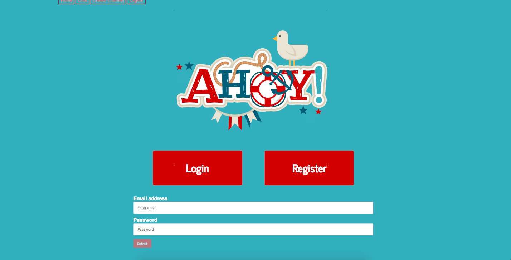

## AHOY!
A clone of Slack.com created from start to finish in one week.

## Authors
- [Cherita Ousley](https://github.com/cheritaousley)
- [Samantha Quach](https://github.com/samq1)
- [Catalina Ene](https://github.com/enecatalina)

## Technologies
- MongoDB
- Express.js
- Angular 4
- Node.js

## Dependencies
- "bcryptjs": "^2.4.3",
- "body-parser": "^1.18.2",
- "ejs": "^2.5.7",
- "express": "^4.16.2",
- "express-session": "^1.15.6",
- "mongoose": "^4.13.5",
- "session": "^0.1.0",
- "socket.io": "^2.0.4",
- "socket.io-client": "^2.0.4",
- "socketio": "^1.0.0"

## Execution
- Clone project
  - https://github.com/cheritaousley/MEANProject_AHOY-.git
- Move into express app
  - cd MEANProject_AHOY-
- run 'nodemon server.js' 
- move into angular app
  - cd angular-app
- run 'ng build --watch'
- run mongodb

